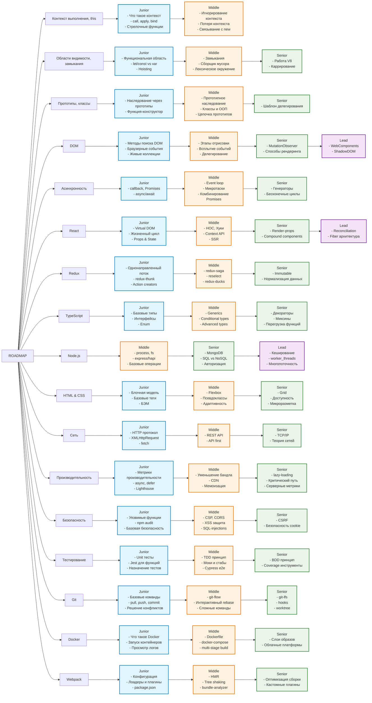

# Frontend Developer Roadmap

## Схема развития Frontend разработчика по уровням

## Детальное описание уровней

### Junior

- **Контекст выполнения**: понимание this, методы call/apply/bind
- **Области видимости**: var vs let/const, hoisting, функциональные области
- **Прототипы**: базовое наследование, функции-конструкторы
- **DOM**: поиск элементов, события, изменение содержимого
- **Асинхронность**: callback, Promise, async/await

### Middle

- **Контекст выполнения**: потеря контекста, игнорирование контекста
- **Области видимости**: замыкания, сборщик мусора, лексическое окружение
- **Прототипы**: цепочка прототипов, классы ES6, ООП принципы
- **DOM**: этапы отрисовки, всплытие событий, делегирование
- **Асинхронность**: Event loop, микротаски, комбинирование Promise

### Senior

- **Контекст выполнения**: продвинутые случаи использования
- **Области видимости**: работа V8, каррирование, оптимизации
- **Прототипы**: шаблон делегирования, продвинутые техники
- **DOM**: MutationObserver, способы рендеринга (SSR/CSR/SSG)
- **Асинхронность**: генераторы, итераторы, продвинутые паттерны

### Lead

- **DOM**: WebComponents, ShadowDOM, Custom Elements
- **React**: Reconciliation, архитектура Fiber
- **Node.js**: кеширование, worker_threads, масштабирование
